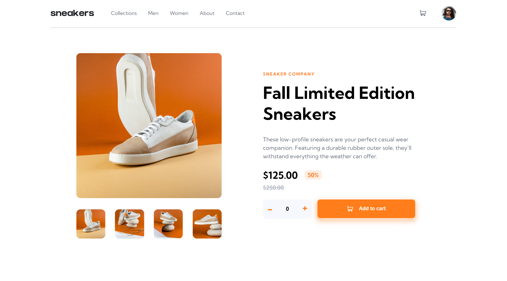

</img>

<h1 align="center">E-commerce Product Page</h1>

  <h3>
    <a href="https://dmaotech-ecommerce-product.netlify.app" color="white">
      Live
    </a>
     | 
    <a href="https://www.frontendmentor.io/solutions/ecommerce-product-page-challenge-ES-YLnCTnN">
      Solution
    </a>
    | 
    <a href="https://www.frontendmentor.io/challenges/ecommerce-product-page-UPsZ9MJp6">
      Challenge
    </a>
  </h3>

   Solution for a challenge from  <a href="https://www.frontendmentor.io/" target="_blank">frontendmentor.io</a>.

 
 

## About The Project

The main challenge is to build out this E-commerce product page and get it looking as close to the design as possible. I used SessionStorage for keeping the cart updated simulating a loged account. (This project can scale)

 
<b>Users should be able to:</b>
<ul>
<li>View the optimal layout for the site depending on their device's screen size</li>
<li>See hover states for all interactive elements on the page</li>
<li>Open a lightbox gallery by clicking on the large product image</li>
<li>Switch the large product image by clicking on the small thumbnail images</li>
<li>Add items to the cart</li>
<li>View the cart and remove items from it</li>
</ul>

  
** I do not have access to the Figma sketch so the design is not pixel perfect.

## Built with 

- Semantic HTML5 markup
- CSS custom properties
- Flexbox
- Mobile-first workflow
- JavaScript
- SessionStorage

## Useful resources

- <a href="https://www.frontendmentor.io/">Frontend Mentor</a>
- <a href="https://developer.mozilla.org/es/docs/Web/API/Window/sessionStorage">SessionStorage</a>

## Social

- Website - [Soon](Soon)
- Frontend Mentor - [@dmaotech](https://www.frontendmentor.io/profile/dmaotech)
- Twitter - [Soon](Soon)
